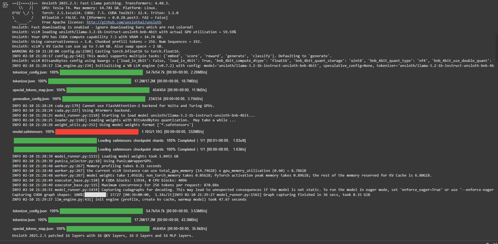
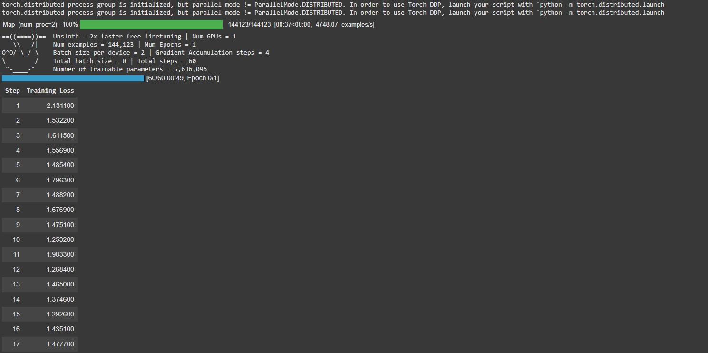

## ***🦙 Fine-tuning Llama 3 with Unlsoth on Haiku Poetry Dataset 🦙***

This project focuses on fine-tuning Meta's llama 3 (reduced to just 1B for the sake of limited GPU) using Unlsoth on a haiku dataset from Kaggle. 
The pipeline ses parameter-effiecient fine-tuning (LoRA), huggingface transformers, and the SFTTrainer from trl. The goal is to generate
original, structured poetry with minimal resource use, and of a higher quality than Llama 3 could do on its own. 

**Please note, the results you get will be directly proportional to amount of GPU you have access to. This .ipynb is largely a proof of work.**

Dependencies:

```bash
%%capture
!pip install unsloth
!pip install kaggle
!pip install trl peft torch
!pip install --upgrade tensorflow transformers datasets accelerate
!pip install unsloth vllm
!pip install --upgrade pillow
!pip install git+https://github.com/huggingface/trl.git@e95f9fb74a3c3647b86f251b7e230ec51c64b72b
```

Load and config the model using Unsloth:

```bash
from unsloth import is_bfloat16_supported
import torch
from unsloth import FastLanguageModel

max_seq_length = 256

model, tokenizer = FastLanguageModel.from_pretrained(
    model_name = "meta-llama/Llama-3.2-1B-Instruct",
    max_seq_length = max_seq_length,
    load_in_4bit = True,
    fast_inference = True,
    gpu_memory_utilization = 0.6,
    device_map="auto",
)

model = FastLanguageModel.get_peft_model(
    model,
    r = 8,
    target_modules = [
        "q_proj", "k_proj", "v_proj", "o_proj",
        "gate_proj", "up_proj", "down_proj",
    ],
    lora_alpha = 8,
    use_gradient_checkpointing = "unsloth",
    random_state = 3407,
)
```



Dataset upload from Kaggle:

First download the dataset to your device by searching "Haiku dataset" on kaggle. Easy to find. 
If you want to try something else, scroll a bit. 
```bash
from google.colab import files
uploaded = files.upload()
```

Preprocessing;
```bash
import pandas as pd

df = pd.read_csv('/content/all_haiku.csv', header=0)

df.rename(columns={
    '0': 'First Line',
    '1': 'Second Line',
    '2': 'Third Line',
}, inplace=True)

df = df[['First Line', 'Second Line', 'Third Line']]

df['First Line'] = df['First Line'].fillna('').astype(str)
df['Second Line'] = df['Second Line'].fillna('').astype(str)
df['Third Line'] = df['Third Line'].fillna('').astype(str)

poems = df['First Line'] + "\n" + df['Second Line'] + "\n" + df['Third Line']
poems = poems[poems.str.strip().apply(lambda x: len(x) > 0)].tolist()
poems_text = "\n".join(poems)
```

Prompt formatting using Alpaca-style template:
```bash
alpaca_prompt = """Below is an instruction that describes a task, paired with an input that provides further context. Write a response that appropriately completes the request.

### Instruction:
{}

### Input:
{}

### Response:
{}"""

EOS_TOKEN = tokenizer.eos_token

def formatting_prompts_func(examples):
    instructions = examples["First Line"]
    inputs = examples["Second Line"]
    outputs = examples["Third Line"]
    texts = []
    for instr, inp, out in zip(instructions, inputs, outputs):
        text = alpaca_prompt.format(instr, inp, out) + EOS_TOKEN
        texts.append(text)
    return {"text": texts}
```

Prepare and map the dataset:
```bash
from datasets import Dataset

dataset = Dataset.from_dict({
    "First Line": df['First Line'],
    "Second Line": df['Second Line'],
    "Third Line": df['Third Line'],
})

dataset = dataset.map(formatting_prompts_func, batched=True)
```

Fine-tuning with SFTTrainer:
```bash
from trl import SFTTrainer
from transformers import TrainingArguments

trainer = SFTTrainer(
    model = model,
    tokenizer = tokenizer,
    train_dataset = dataset,
    dataset_text_field = "text",
    max_seq_length = max_seq_length,
    dataset_num_proc = 2,
    packing = False,
    args = TrainingArguments(
        per_device_train_batch_size = 2,
        gradient_accumulation_steps = 4,
        warmup_steps = 5,
        num_train_epochs = 1,
        max_steps = 60,
        learning_rate = 2e-4,
        fp16 = not is_bfloat16_supported(),
        bf16 = is_bfloat16_supported(),
        logging_steps = 1,
        optim = "adamw_8bit",
        weight_decay = 0.01,
        lr_scheduler_type = "linear",
        seed = 3407,
        output_dir = "outputs",
        report_to = "none",
    ),
)

trainer_stats = trainer.train()
```


Inference: generate custom haiku: 
```bash
FastLanguageModel.for_inference(model)

inputs = tokenizer(
[
    alpaca_prompt.format(
        "Give me a beautiful, long haiku about nature",
        "",
        "",
    )
], return_tensors = "pt").to("cuda")

outputs = model.generate(**inputs, max_new_tokens = 64, use_cache = True)
tokenizer.batch_decode(outputs)
```


